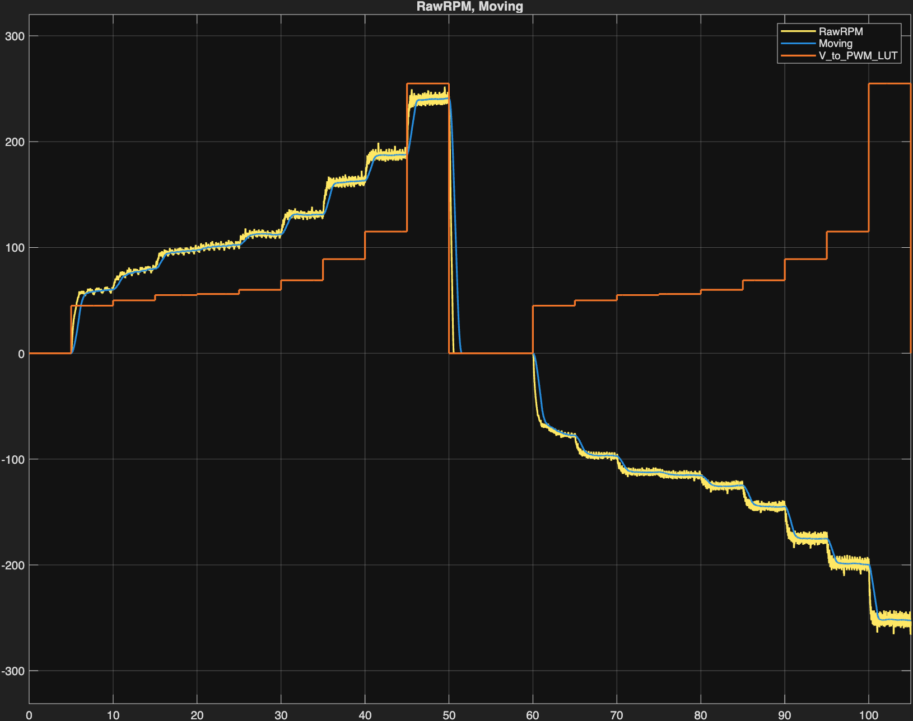
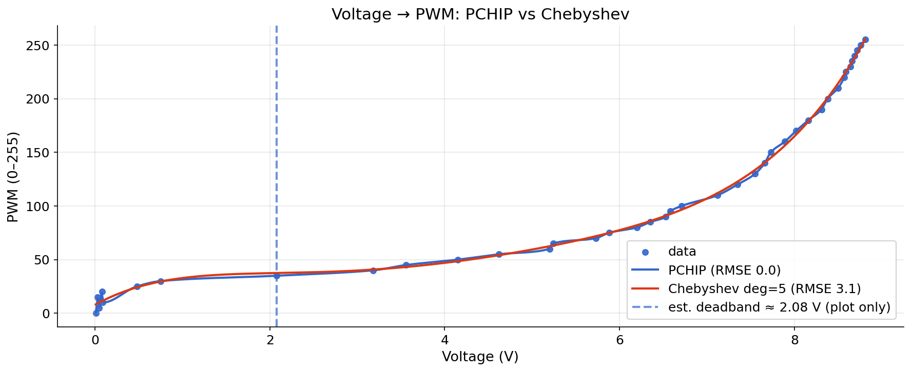
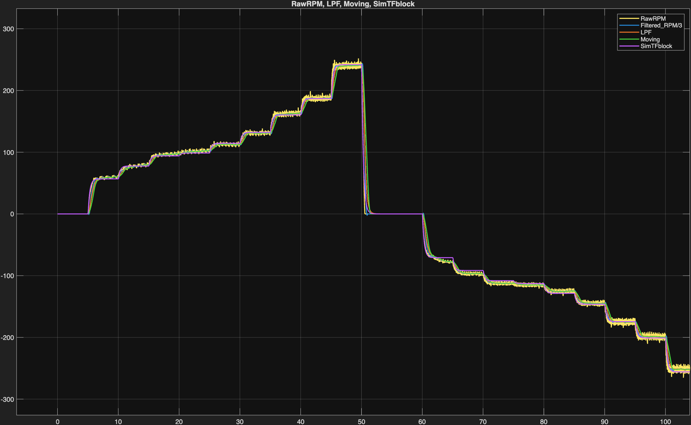
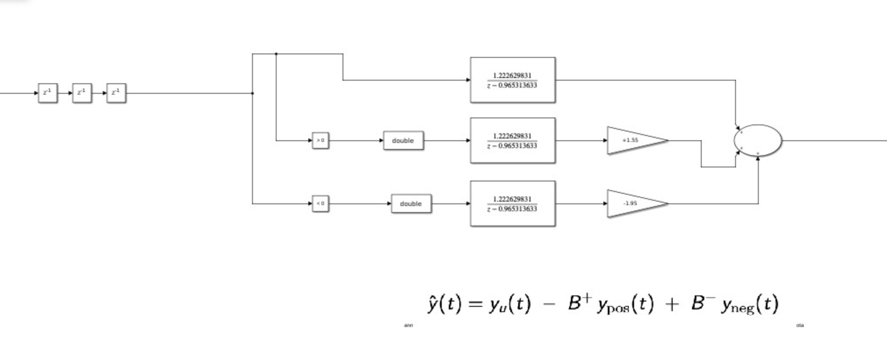
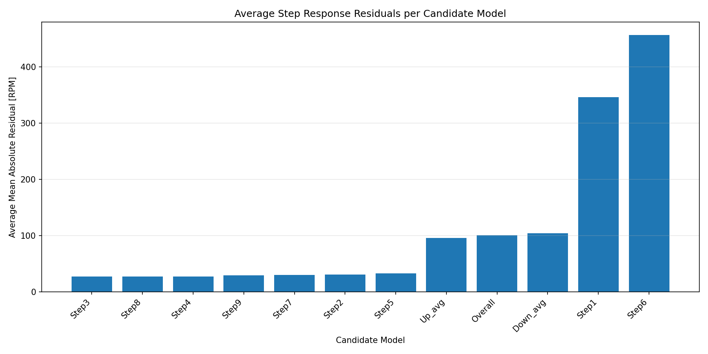
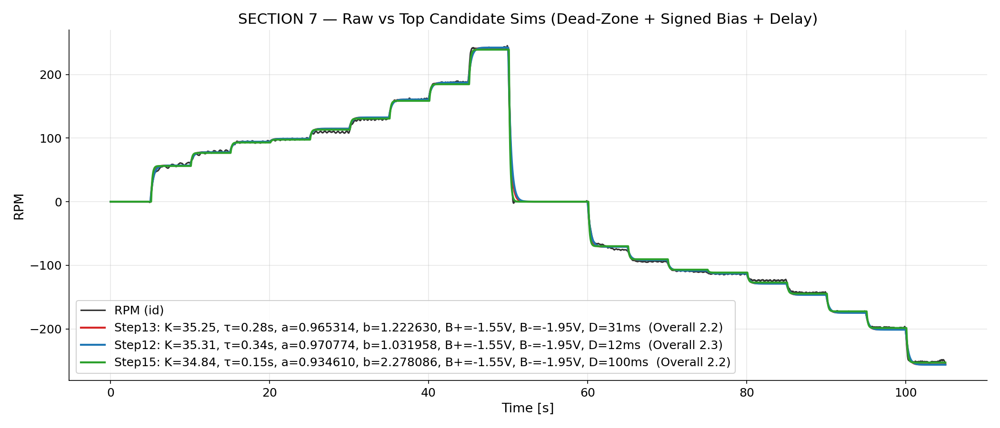
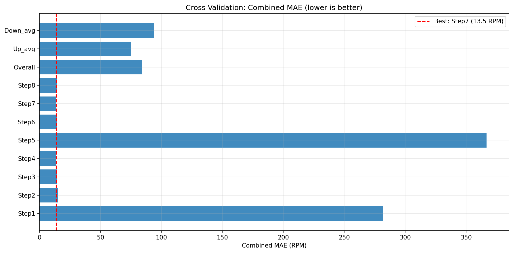
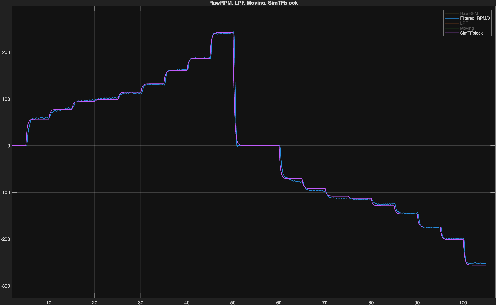
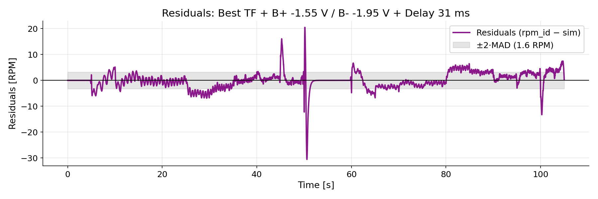

# A Practical Pipeline for DC Motor Identification with Dead-Zone, Signed Bias, and Small Delay

**Author:** Piyush Tiwari
**Contact:** piyusht24@iitk.ac.in  
**Repository:** https://github.com/Piyushiitk24/dc-motor-signed-bias-deadzone-id-control

---

## Abstract

Identification of low-cost DC motors is frequently complicated by actuator nonlinearities, particularly when using common drivers such as the L298N that exhibit significant voltage drop and thermal drift. These effects manifest as a voltage dead-zone, asymmetric responses to command polarity, and a small but significant time delay, which cannot be captured by a single linear model. This experiment report presents a practical identification pipeline that models these phenomena as a compact cascade preceding a first-order discrete plant. The cascade consists of a static dead-zone, a fractional-sample delay, and signed biases to account for the asymmetry. Parameters are identified using a repeating staircase excitation signal designed to exercise the system across its full operating range. A two-stage (coarse-to-fine) grid search efficiently determines the delay and bias parameters by minimising the median per-step mean absolute error. The proposed method, executable in under seven minutes on a cloud platform (Google Colab), yields a high-fidelity model and exports controller-ready discrete parameters $(a,b)$. The resulting model demonstrates a substantial reduction in prediction error compared to a conventional linear fit.

---

## 1. Context and Motivation

The performance of a model-based controller is fundamentally limited by the accuracy of the plant model. For low-cost mechatronic systems, datasheet parameters are often unreliable, necessitating empirical system identification. This work focuses on a common laboratory setup: a geared DC motor driven by an L298N H-bridge module, a component known for its non-ideal behaviour.

An initial investigation revealed a significant voltage shortfall: despite a regulated 12 V power supply, the voltage measured at the motor terminals was consistently limited to 8.8–9.1 V, with noticeable drift corresponding to the driver’s operating temperature. This power delivery issue creates a fragile operating environment, especially near zero speed, and gives rise to three nonlinear effects that must be addressed for accurate modelling:

1. **Voltage dead-zone** — small commands produce no response.  
2. **Polarity asymmetry** — forward and reverse responses differ for the same magnitude.  
3. **Short transport delay** — a small lag from command to measured RPM.

A conventional LTI transfer function cannot simultaneously represent this combination of dead-zone, delay, and direction-dependent dynamics. The central premise is that these actuator-centric nonlinearities must be identified and compensated first. By modelling them explicitly, a simple, low-order linear plant can describe the underlying dynamics, enabling effective controller design.

---

## 2. System Setup, Automation, and Data Path

The automation pipeline originates in Simulink. Both the simulation and hardware-in-the-loop models were maintained in a single workspace. Raw signals (PWM command, mapped voltage, and RPM) were exported through `To Workspace` blocks in structure-with-time format. A short MATLAB script wrote arrays to a timestamped folder containing CSV files with `time [s]`, `voltage [V]`, and `rpm`. These records were consumed by a Python notebook for preprocessing, step detection, model search, and export of deployment-ready parameters.

  
*Figure 1 — Staircase input and responses.*

---

## 3. Hardware and Data at a Glance

- **Motor:** 12 V, 300 RPM with gearbox (≈ 60:1)  
- **Driver:** L298N dual H-bridge (notable internal drop; effective supply 8.8–9.1 V, temperature sensitive)  
- **Sensor:** Optical encoder 2400 CPR (post-quadrature)  
- **Controller/DAQ:** Arduino Mega; logging via Simulink/MATLAB to CSV  
- **Supply and Logic:** 12 V adapter; driver logic from Arduino 5 V with onboard jumper off  
- **Sampling time:** $T_s = 0.01\ \mathrm{s}$ throughout

Electrical parameters: $R \approx 1.371\ \Omega$, $L \approx 0.0003\ \mathrm{H}$ giving $L/R \approx 0.22\ \mathrm{ms}$. An identified mechanical time constant around 0.2–0.3 s supports the first-order plant assumption.

---

## 4. Excitation Signal Design

A repeated-sequence staircase ($0 \to +V_{\max}$, back to $0$, then to $-V_{\max}$) was intentionally used. Multiple step magnitudes in both directions improve robustness: a first-order model that fits a single step may not generalise across steps and polarities, whereas a staircase exposes biases, delay, and dead-zone consistently near reversals. Concentrating samples around the sign change further sharpens sensitivity to near-zero effects.

### Table 1 — Designed repeating-sequence staircase (command voltage vs. time)

| Seg. | Start t [s] | V [V] | Dur. [s] |
|---:|---:|---:|---:|
| 1 | 0 | 0.00 | 5 |
| 2 | 5 | 3.56 | 5 |
| 3 | 10 | 4.15 | 5 |
| 4 | 15 | 4.62 | 5 |
| 5 | 20 | 4.75 | 5 |
| 6 | 25 | 5.20 | 5 |
| 7 | 30 | 5.70 | 5 |
| 8 | 35 | 6.50 | 5 |
| 9 | 40 | 7.25 | 5 |
| 10 | 45 | 8.81 | 5 |
| 11 | 50 | 0.00 | 5 |
| 12 | 55 | 0.00 | 5 |
| 13 | 60 | -3.56 | 5 |
| 14 | 65 | -4.15 | 5 |
| 15 | 70 | -4.62 | 5 |
| 16 | 75 | -4.75 | 5 |
| 17 | 80 | -5.20 | 5 |
| 18 | 85 | -5.70 | 5 |
| 19 | 90 | -6.50 | 5 |
| 20 | 95 | -7.25 | 5 |
| 21 | 100 | -8.81 | 5 |
| 22 | 105 | 0.00 | 0 |

> Source: `tables/stair_table.tex`

---

## 5. Voltage–PWM Mapping

A consistent notion of “one volt” was enforced between model and hardware. From ~150 calibration pairs (measured driver output vs. PWM), a **monotone PCHIP** map was created in Python and its inverse was applied to all commands during analysis. For deployment in Simulink, a lookup table with the same calibration data was used so that the hardware used exactly the recorded points. Although PCHIP exactly interpolates the calibration pairs, a slightly different plot-only dead-zone appears near zero; this is explained by voltmeter sensitivity and the physical $\pm\,3.5\ \mathrm{V}$ threshold was retained.

  
*Figure 2 — Voltage–PWM mapping and comparison.*

---

## 6. Preprocessing and Step Detection

Three smoothers were compared on identical RPM traces: a moving average (window 50), a default Simulink low-pass, and Savitzky–Golay (odd window, polynomial 2–3). Savitzky–Golay preserved step edges best and minimised downstream identification error in offline analysis. To meet real-time constraints, a short discrete FIR was tuned in Simulink/Arduino so that its magnitude/phase over the relevant band emulated the Savitzky–Golay result while remaining lightweight due to Arduino memory limits.

  
*Figure 3 — Filter comparison.*

Steps in the mapped input were detected by a **median absolute deviation (MAD)**-based threshold with minimum amplitude and dwell, which segmented the staircase into positive and negative step windows used throughout scoring.

---

## 7. Model Structure

Let $u[k]$ denote the commanded voltage after PWM-to-V mapping. A cascade of static nonlinearity and delay feeds a first-order discrete plant:

**(a) Dead-zone** ($D>0$):
$$
\tilde{u}[k] =
\begin{cases}
0, & |u[k]| \le D,\\
\operatorname{sgn}(u[k])\big(|u[k]|-D\big), & |u[k]|>D.
\end{cases}
$$

**(b) Small delay (fractional samples)** with $n=\lfloor\theta/T_s\rfloor$ and $f=\theta/T_s-n$:
$$
u_{\mathrm{d}}[k] = (1-f)\,\tilde{u}[k-n] + f\,\tilde{u}[k-n-1].
$$

**(c) Signed bias** (polarity asymmetry):
$$
\hat{u}[k] =
\begin{cases}
u_{\mathrm{d}}[k]+B^+, & u_{\mathrm{d}}[k]>0,\\
u_{\mathrm{d}}[k]+B^-, & u_{\mathrm{d}}[k]<0,\\
0, & u_{\mathrm{d}}[k]=0.
\end{cases}
$$

**(d) First-order plant (discrete, ZOH)**:
$$
y[k+1] = a\,y[k] + b\,\hat{u}[k], \qquad a = e^{-T_s/\tau}, \quad b = K(1-a).
$$

This arrangement allows a single first-order dynamic element to remain valid in both directions once small biases and delay are absorbed up front.

  
*Figure 4 — Simulink realisation.*

### Why $(a,b)$ (and not $K,\tau$) in deployment

- Exact ZOH discretisation ensures the simulation matches the microcontroller sample-for-sample.  
- Better numerical conditioning by avoiding repeated evaluation of $e^{-T_s/\tau}$ on embedded hardware.  
- Simulink/codegen blocks interface cleanly with $(a,b)$, reducing parameter drift between analysis and deployment.

---

## 8. First-Order Step Fits

From per-step first-order fits before applying signed biases, median parameters were obtained as:
$$
K \approx 35.18\ \mathrm{RPM/V}, \qquad \tau \approx 0.300\ \mathrm{s},
$$
with median $R^2 \approx 0.974$ (median step MAE $\approx 0.53\ \mathrm{RPM}$). These values justify a single first-order plant once signed bias handles asymmetry.

---

## 9. Search Algorithm for Delay and Signed Biases

A two-stage grid search was performed around a fixed dead-zone $D$ and initial $(K,\tau)$ from step fits. Candidates were scored by the **median per-step MAE** across the entire staircase run.

**Algorithm Outline**
1. **Data preparation:** apply the inverse voltage map to PWM; smooth RPM (Savitzky–Golay offline / FIR online); detect step windows via MAD with amplitude/dwell guards.  
2. **Plant prefit:** obtain $(K,\tau)$ by first-order fits over many steps; fix $D$ from a voltage sweep around $\pm\,3.5\ \mathrm{V}$.  
3. **Coarse search:** sweep $\theta\in[0,\,0.30]$ s and $(B^+,B^-)\in[-5,\,5]$ V on a coarse grid; simulate and compute MAE per step; retain top-$K$ by median MAE.  
4. **Fine search:** centre a denser grid around retained triples; rescore; select by median MAE (report IQR as dispersion).  
5. **Export:** compute $(a,b)$ at $T_s=0.01$ s and fractional-delay taps $(w_0,w_1)=(1-f,f)$ with $f=\theta/T_s-n$.

**Reproducible Pseudocode (vectorised)**

```python
INPUTS: t, pwm_cmd, rpm; Ts = 0.01
CALIB: invert_map = PCHIP(about 150 pairs); fixed dead-zone D approx 3.5 V
OUTPUTS: a, b, Bp, Bn, theta, n, f, (w0, w1)

# Map, smooth, and segment
u   = invert_map(pwm_cmd)            # volts
y   = smooth(rpm)                    # SG offline / FIR online
S   = detect_steps(u, method="MAD")  # [ (i0,i1), ... ]

# Baseline FO plant (sanity)
K, tau = fit_many_steps(u, y, S)

# Two-stage search (vectorised grids)
best = []
for (theta, Bp, Bn) in GRID(stage="coarse"):
    yhat = simulate(u, D, theta, Bp, Bn, K, tau, Ts)
    s    = mae_per_step(y, yhat, S)          # vector
    best = keep_topK(best, (theta,Bp,Bn), median(s), IQR(s))

for (theta, Bp, Bn) in GRID(center=best, stage="fine"):
    yhat = simulate(u, D, theta, Bp, Bn, K, tau, Ts)
    s    = mae_per_step(y, yhat, S)
    best = keep_topK(best, (theta,Bp,Bn), median(s), IQR(s))

# Export discrete params
n = floor(theta/Ts); f = theta/Ts - n
w0, w1 = 1-f, f
a = exp(-Ts/tau); b = K*(1-a)
````


*Figure 5 — Average step residuals.*


*Figure 6 — Full-run overlays (top candidates).*

---

## 10. Final Run: Selected Candidate and Leaderboard

### Selected candidate (Step13)

* $K = 35.248$, $\tau = 0.283\ \mathrm{s}$, $a = 0.965314$, $b = 1.222630$ (ZOH, $T_s = 0.01\ \mathrm{s}$)
* $B^+ = -1.55\ \mathrm{V}$, $B^- = -1.95\ \mathrm{V}$, $\theta = 31.25\ \mathrm{ms} \Rightarrow n=3,\ f=0.125,\ (w_0,w_1)=(0.875,,0.125)$
* Dead-zone: $D^+ = +3.50\ \mathrm{V}$, $D^- = -3.50\ \mathrm{V}$
* **Overall MAE:** **2.209 RPM**


*Figure 7 — Combined scores (CV).*


*Figure 8 — Final run overlay (best TF).*

### Table 2 — Cross-validation leaderboard (sorted by Overall MAE)

| Candidate |      K | tau [s] | B+ [V] | B- [V] | theta [s] | MAE [RPM] | Mean-step MAE [RPM] |
| --------: | -----: | ------: | -----: | -----: | --------: | --------: | ------------------: |
|    Step13 | 35.248 |   0.283 | -1.550 | -1.950 |     0.031 |     2.209 |              16.202 |
|    Step15 | 34.838 |   0.148 | -1.550 | -1.950 |     0.100 |     2.225 |              16.363 |
|     Step7 | 35.178 |   0.149 | -1.550 | -1.950 |     0.100 |     2.284 |              16.306 |
|    Step12 | 35.309 |   0.337 | -1.550 | -1.950 |     0.012 |     2.287 |              16.290 |
|     Step6 | 33.252 |   0.300 | -1.725 | -2.175 |     0.042 |     2.622 |              17.098 |
|     Step2 | 32.814 |   0.576 | -1.800 | -2.275 |     0.000 |     3.725 |              18.229 |
|     Step5 | 38.242 |   0.300 | -1.250 | -1.575 |     0.012 |     4.289 |              16.242 |
|    Step10 | 31.072 |   0.366 | -1.950 | -2.425 |     0.021 |     4.460 |              18.659 |
|     Step4 | 40.316 |   0.368 | -1.025 | -1.400 |     0.000 |     6.396 |              16.512 |
|    Step14 | 27.510 |   0.285 | -2.350 | -2.900 |     0.071 |     7.838 |              21.023 |
|     Step8 | 47.680 |   0.276 | -0.625 | -0.925 |     0.019 |    13.941 |              18.495 |
|    Step11 | 18.073 |   0.279 | -4.375 | -5.150 |     0.113 |    17.509 |              29.145 |

> Source: `tables/cv_leaderboard.tex`

---

## 11. Validation Visuals

Most residuals lie within a $\pm 2$ MAD band (≈ 1.6 RPM); spikes at reversals and one larger negative excursion around 50–52 s are consistent with brief unmodelled effects (current saturation together with encoder-edge artefacts).


*Figure 9 — Residuals with MAD band.*

---

## 12. Contributions

* A generalisable, coarse-to-fine identification procedure that locates delay and signed biases quickly (≈ 6–7 min on Colab) using median per-step MAE over a staircase run.
* A compact cascade (dead-zone, fractional delay, signed bias, first-order plant) capturing low-speed behaviour on low-cost hardware without invoking named block models.
* Plug-and-play export for Simulink/Arduino, providing $(a,b,D^+,D^-,B^+,B^-)$ and $\theta$, and delay taps $(w_0,w_1)$, plus a lookup-based PWM map.
* Evidence via overlays, residuals, and sensitivity that the approach remains accurate and practical under measurement noise and temperature drift of the driver.

---

## 13. Limitations and Next Steps

The dead-zone was treated as fixed, although it may drift with temperature/load and with ageing. A single $(K,\tau)$ was used for both directions; if residuals show polarity-dependent dynamics, splitting the plant into $(K^+,\tau^+)$ and $(K^-,\tau^-)$ may be explored. The Savitzky–Golay surrogate FIR may slightly bias very fast transients; results with raw RPM can be reported or the tach filter can be modelled explicitly.

**Next steps:**
(i) adaptively re-estimate the dead-zone each run by a short voltage sweep around $\pm,3.5\ \mathrm{V}$;
(ii) re-calibrate the PWM-to-V lookup whenever the measured $V_{\text{out}}$ at PWM = 255 differs from historical values;
(iii) expose a one-click routine in the Python notebook to regenerate $(a,b,\theta,B^+,B^-)$; and
(iv) design and validate a PI controller around the FO+delay plant using the exported parameters.

---

## 14. Reproducibility and Artefacts

* **Repository (notebooks, scripts, outputs):**
  [https://github.com/Piyushiitk24/dc-motor-signed-bias-deadzone-id-control](https://github.com/Piyushiitk24/dc-motor-signed-bias-deadzone-id-control)
* **Inputs:** CSV logs `time [s]`, `voltage [V]` (mapped), `rpm`.

**Rapid re-identification (field workflow)**

1. Measure $V_{\text{out}}$ at PWM = 255 (full duty) at the driver terminals; update the lookup if it has changed.
2. Export `time`, `voltage`, and `rpm` via Simulink `To Workspace` blocks; the MATLAB script writes a timestamped folder.
3. Open the notebook in the repository and *Run All*. Parameters $(a,b,\theta,B^+,B^-)$ and delay taps are regenerated in ≈ 6–7 min with $T_s=0.01$ s.

---

## Repository Structure (for this README)

```
.
├── README.md                 # This file
├── figs/                     # All figures referenced above
│   ├── voltage_with_rpm.png
│   ├── mapping_pchip_vs_cheby.png
│   ├── all_filters_compare.png
│   ├── Final_Simulink_Setup.png
│   ├── average_step_residuals_bar_chart.png
│   ├── full_overlays_top3.png
│   ├── combined_scores_bar.png
│   ├── final_simulink_run_with_best_tf.png
│   └── final_residuals.png
├── tables/
│   ├── stair_table.tex       # Source for Table 1 (stairs)
│   └── cv_leaderboard.tex    # Source for Table 2 (leaderboard)
└── notebooks   
```
